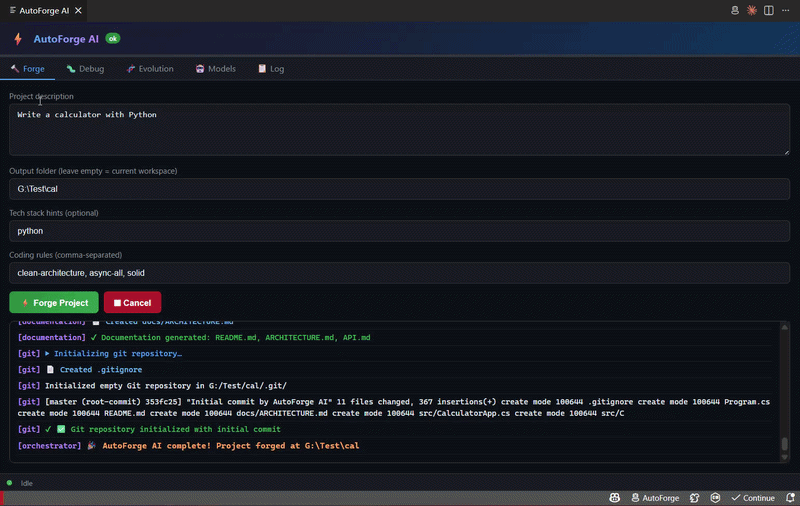

# ⚡ AutoForge AI

> **Autonomous Local AI Software Engineer** — describe a project, watch it build itself.

[](https://python.org)
[](https://fastapi.tiangolo.com)
[](https://typescriptlang.org)
[](https://code.visualstudio.com)
[](https://ollama.ai)
[](LICENSE)

AutoForge AI is a **multi-agent local AI system** that autonomously generates complete software projects — backend, frontend, database, documentation, and git history — running entirely on your machine with no API costs.

---

## 🎬 Demo



---

## 🚀 What It Does

Type a project description. AutoForge AI:

1. **🏛 Architect Agent** — designs the full architecture, selects patterns (Clean Architecture, CQRS, DDD), defines entities and API endpoints
2. **🗄 Database Agent** — generates SQL schema, EF Core DbContext, entity configurations, migrations, seed data
3. **⚙ Backend Agent** — writes complete C# .NET 8 Web API: Controllers, Services, Repositories, DTOs, Middleware
4. **🎨 Frontend Agent** — scaffolds React + TypeScript + Vite + Tailwind CSS: pages, components, API services
5. **🐛 Debug Agent** — runs `dotnet build`, parses errors, asks Ollama to fix them, rebuilds — loops up to 5x
6. **📚 Documentation Agent** — generates README.md, ARCHITECTURE.md, API reference
7. **🔀 Git Agent** — initializes git, writes `.gitignore`, creates the initial commit

---

## 🧬 Evolution Mode

A nightly APScheduler job analyzes your codebase for:
- Duplicate code that should be refactored
- Missing `async/await` on I/O operations
- SOLID principle violations
- EF Core N+1 query problems

HIGH priority fixes are automatically applied on a new git branch.

---

## 🏗 Architecture

```
AutoForge AI
├── backend/                    # Python FastAPI — multi-agent engine
│   ├── app/
│   │   ├── agents/             # 8 specialized AI agents
│   │   │   ├── architect.py    # Architecture planning (qwen2.5:7b)
│   │   │   ├── backend.py      # C# code generation (deepseek-coder-v2:16b)
│   │   │   ├── frontend.py     # React TS generation (deepseek-coder-v2:16b)
│   │   │   ├── database.py     # SQL + EF Core (deepseek-coder-v2:16b)
│   │   │   ├── debug.py        # Build error fix loop (codellama:13b)
│   │   │   ├── documentation.py # README + docs (llama3.2:3b)
│   │   │   ├── git_agent.py    # Git operations (llama3.2:3b)
│   │   │   └── base.py         # BaseAgent with shared helpers
│   │   ├── core/
│   │   │   ├── ollama.py       # Multi-model Ollama client + parsers
│   │   │   ├── memory.py       # SQLite persistent project context
│   │   │   ├── context.py      # File indexer + relevant-file search
│   │   │   ├── rules.py        # Coding rule engine + templates
│   │   │   ├── terminal.py     # Sandboxed subprocess executor
│   │   │   ├── manager.py      # Orchestration pipeline
│   │   │   └── evolution.py    # Nightly quality analysis
│   │   ├── models/
│   │   │   └── schemas.py      # Pydantic models (ForgeRequest, SSEEvent…)
│   │   └── main.py             # FastAPI app: /forge /debug /evolve
│   ├── config.yaml             # Model assignments + terminal allow-list
│   └── requirements.txt
│
└── extension/                  # VSCode Extension (TypeScript)
    ├── src/
    │   ├── extension.ts        # Activation + command registration
    │   ├── panels/
    │   │   └── AgentPanel.ts   # Webview chat UI with live SSE log
    │   └── services/
    │       └── BackendClient.ts # HTTP + SSE client
    └── package.json
```

---

## 🤖 Multi-Model Strategy

| Agent | Ollama Model | Why |
|---|---|---|
| Architect | `qwen2.5:7b` | Fast, strong reasoning for planning |
| Backend / Frontend / Database | `deepseek-coder-v2:16b` | Best-in-class code generation |
| Debug / Reviewer | `codellama:13b` | Error analysis + code understanding |
| Docs / Git | `llama3.2:3b` | Fast, cheap for text generation |

All models are local — zero API costs, complete privacy.

---

## ⚡ Quick Start

### Prerequisites

- Python 3.12+
- [Ollama](https://ollama.ai) running locally
- Node.js 20+ (for VSCode extension development)
- VSCode 1.85+

### 1. Pull Ollama models

```bash
ollama pull qwen2.5:7b
ollama pull deepseek-coder-v2:16b
ollama pull codellama:13b
ollama pull llama3.2:3b
```

### 2. Start the backend

```bash
cd backend
pip install -r requirements.txt
uvicorn app.main:app --host 0.0.0.0 --port 8003 --reload
```

### 3. Install the VSCode extension

```bash
cd extension
npm install
npm run compile
```

Then press `F5` in VSCode to launch the Extension Development Host.

Or install directly:
```bash
npx vsce package
code --install-extension autoforge-ai-1.0.0.vsix
```

### 4. Use it

- Click **⚡ AutoForge** in the VSCode status bar
- Or run command: `AutoForge AI: Open Panel`
- Type your project description → **Forge Project**

---

## 🐳 Docker

```bash
docker-compose up -d
```

---

## 📡 REST API

| Method | Endpoint | Description |
|--------|----------|-------------|
| `POST` | `/forge` | Full pipeline — SSE stream |
| `POST` | `/debug` | Build + auto-fix — SSE stream |
| `POST` | `/evolve` | Evolution analysis — SSE stream |
| `GET` | `/health` | Ollama status + model list |
| `GET` | `/models` | Available Ollama models |
| `GET` | `/memory/{path}` | Project memory / history |
| `GET` | `/context/{path}` | Project file index |

### Forge request example

```json
POST /forge
{
  "prompt": "Build a warehouse management API with C# .NET 8, PostgreSQL, Clean Architecture, JWT auth",
  "project_path": "/output/my-project",
  "tech_stack": { "backend": "C# .NET 8", "database": "PostgreSQL" },
  "rules": ["clean-architecture", "async-all", "repository-pattern"]
}
```

---

## 🛡 Coding Rules Engine

Built-in rules you can apply:

| Rule | Description |
|------|-------------|
| `clean-architecture` | Domain → Application → Infrastructure → Presentation layers |
| `repository-pattern` | Repository Pattern for all data access |
| `fluent-validation` | FluentValidation for all input validation |
| `solid` | Strict SOLID principles |
| `async-all` | All I/O must be async/await |
| `cqrs` | CQRS with MediatR |
| `ddd` | Domain-Driven Design |
| `dto-mapping` | DTOs + AutoMapper, never raw entities |

---

## 🧑‍💻 Built By

**Ali Badloo** — Software Engineer specializing in Industrial Automation, WMS, and AI systems.

- GitHub: [@Alibadloo](https://github.com/Alibadloo)
- Email: alibadlu13@gmail.com

---

## 📄 License

MIT License — see [LICENSE](LICENSE) file.
